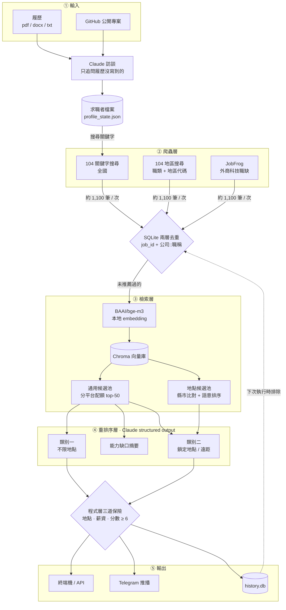

# job-recommender

> 讀我的履歷、爬取職缺,用語意檢索加 LLM 判讀,每天推播「值得投、而且還沒看過」的職缺,並說明為什麼適合我。

---

## 架構圖



四個進入點共用同一條 `pipeline.py`:

| 指令 | 互動 | 用途 |
|---|---|---|
| `python setup_profile.py [履歷]` | 是 | 訪談,建立/更新求職者檔案(只需跑一次) |
| `python run.py` | 否 | 跑推薦;排程與容器用 |
| `python main.py [履歷]` | 是 | 訪談 + 推薦一次跑完 |
| `uvicorn api:app` | — | HTTP API,可遠端觸發與查詢 |

---

## 成果數字

| 指標 | 數字 | 說明 |
|---|---|---|
| 每次處理職缺 | 約 1,100 筆 | 104 關鍵字 + 104 地區 + JobFrog,去重後進入檢索 |
| 地點候選池 | **4 → 86 筆** | 改用 104 地區結構化搜尋後,南部職缺供給大幅增加 |
| 地點類別推薦品質 | 4 筆含 3 筆無關 → **10 筆全為 AI/資料職缺** | 同上,加上分數門檻 |
| JobFrog 推薦產出 | 連續 6 次 **0 筆 → 修正後首次 4 筆**(7–8 分) | 分平台配額檢索修正文本長度偏差 |
| 程式層攔截 | 每次約 1–3 筆 | LLM 自己給低分或理由自相矛盾、卻仍列入結果的推薦 |
| 資料源 | 接入 4 個 → **保留 2 個** | 依推薦歷史的平台貢獻度汰除 |
| 測試 | **107 個,約 2 秒** | 不需載入 embedding 模型 |
| 累計推薦 | 【待填:`GET /stats` 的 `total`】 | 即時數字可從 API 取得 |

**這些是系統與工程指標,不是推薦準確率。** 推薦品質目前尚無量化指標,見「已知限制」。

---

## 技術選擇與原因

| 選擇 | 原因 | 代價 |
|---|---|---|
| **兩階段檢索**<br/>向量初篩 → LLM 重排序 | 語意相似不代表合適;薪資、地點這類硬性條件無法用相似度表達 | 每次多兩次 LLM 呼叫 |
| **分平台配額取用**<br/>round-robin | 各平台描述長度相差約 20 倍,向量相似度受文件長度影響,文本稀薄的來源在檢索階段就被淘汰 | 強勢平台少拿幾個候選名額 |
| **程式層三道保險**<br/>地點 · 薪資 · 分數 | prompt 約束不可靠(模型會寫「略低於下限但仍可考量」繞過規則),但它的評分是誠實的 → 判斷交給 LLM,否決權留在程式 | 推薦數可能少於設定值(刻意:寧缺勿濫) |
| **BAAI/bge-m3** 本地 embedding | Anthropic 沒有 embedding 服務;中文效果好、支援長文本;職缺文本不離開本機 | 首次下載約 2GB,部署需 2GB 以上記憶體 |
| **Chroma**(in-memory) | 職缺每次重新爬取,向量不需持久化 | 每次執行重建索引 |
| **SQLite 兩層去重**<br/>`job_id` + `公司::職稱` | 職缺下架重刊會換新 ID,只比對 ID 會重複推薦 | 同公司同職稱的真正新職缺也會被擋 |
| **LangChain** `with_structured_output()`<br/>(只用這一塊) | Claude 透過 tool-use 回傳符合 Pydantic schema 的參數,格式錯誤從「事後修復」變成「不會發生」;先前曾有字串分數 `"5"` 靜默繞過門檻 | 多一個依賴;刻意不引入 chain、agent、memory |
| **FastAPI** + 背景執行 | 完整流程需數分鐘,超過 HTTP 逾時 → `POST /runs` 立即回 `202`,輪詢 `GET /runs/{id}` | 執行狀態存在記憶體,重啟即失 |
| **`filters.py` 獨立模組** | 篩選規則是純函式,拆出後測試不必載入 2GB 模型 | — |

### 兩個值得展開的發現

**檢索偏差。** 推薦歷史顯示 JobFrog 每次爬回 700 多筆職缺,卻連續六次零推薦。
實測爬蟲資料完全正常,問題在檢索:104 描述兩三百字,JobFrog 只有「新竹 · 實習 · <1年」
十幾個字,放進同一個排序,後者在相關性被評估之前就出局了。改成分平台輪流取用後
立即產出 7–8 分的推薦。`config.RETRIEVE_BALANCED` 保留開關可對照兩種策略。

**資料源汰除。** CakeResume 三次取得公平配額仍零推薦,根因是取樣方式(sitemap
字母排序前 N 家公司)與目標領域無關。1111 修好逾時與解析後,回傳結果卻與查詢條件
完全無關;執行爬蟲後同一台機器的瀏覽器搜尋也開始異常,判定為 IP 層級的降級服務。
繼續嘗試需要規避對方的防護措施,因此停用,改由 104 地區搜尋補足南部供給。
兩支停用的爬蟲保留在 `crawlers/`,檔頭記錄完整的調查過程。

---

## 如何執行

```bash
pip install -r requirements.txt

export ANTHROPIC_API_KEY=sk-ant-...          # Windows: $env:ANTHROPIC_API_KEY = "sk-ant-..."

python setup_profile.py 你的履歷.pdf          # 1. 互動訪談,建立求職者檔案(一次)
python run.py                                # 2. 跑推薦
python run.py --dry-run                      #    只看結果,不寫歷史、不推播
```

首次執行會下載 BGE-M3 模型(約 2GB),之後走本地快取。

**HTTP API**

```bash
uvicorn api:app --reload
# 開 http://127.0.0.1:8000/docs 看自動生成的互動文件
```

`GET /health` · `GET /profile` · `GET /recommendations` · `GET /stats` · `POST /runs` · `GET /runs/{id}`

**測試**

```bash
pytest                                        # 107 passed
```

**Telegram 推播(選填)**:向 [BotFather](https://t.me/BotFather) 申請 Bot →
傳一則訊息給它 → `python notifier.py` 取得 `chat_id` → 設定 `TELEGRAM_BOT_TOKEN`
與 `TELEGRAM_CHAT_ID`。未設定時只輸出到終端機。

**主要設定**(`config.py`)

| 設定 | 預設 | 說明 |
|---|---|---|
| `MIN_RECOMMEND_SCORE` | 6 | 低於此分不推薦 |
| `RETRIEVE_TOP_K` | 50 | 向量檢索候選池大小 |
| `RETRIEVE_BALANCED` | True | 分平台配額;False 可對照全域 top-K |
| `SEARCH_104_AREA` / `SEARCH_104_JOBCAT` | 台南、高雄 | 從 104 篩選器的網址複製代碼 |

---

## 已知限制

- **沒有推薦準確率指標。** 目前只能主觀判斷推薦準不準。計畫在 `history.db` 加入「是否投遞」
  欄位,累積數週後計算 precision@10。
- **爬蟲對網站改版沒有防護。** 單元測試涵蓋資料轉換層,擋不住 selector 失效或 API 格式變動,
  也沒有監控告警。
- **104 關鍵字搜尋相關性偏鬆。** 它比對職缺全文,搜「資料分析」會撈回描述中提到該詞的測試工程師,
  實際相關性依賴後段的檢索與重排序把關。
- **部分職缺缺少薪資資訊。** JobFrog 沒有薪資欄位,薪資保險對這些職缺等於不生效。
- **API 執行狀態存在記憶體**,重啟即失;單一使用者假設,沒有多使用者隔離。

---

<sub>爬蟲設有 1.5–3.5 秒隨機請求間隔與頁數上限。本專案供個人求職使用,使用前請自行確認目標網站的服務條款與 robots.txt。</sub>
